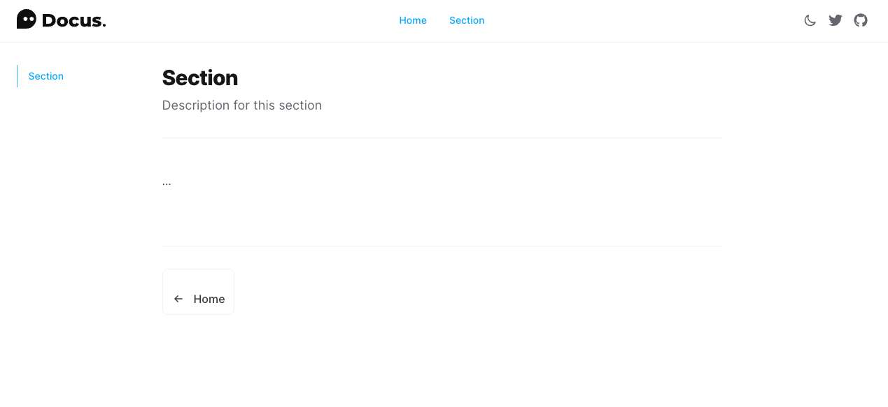
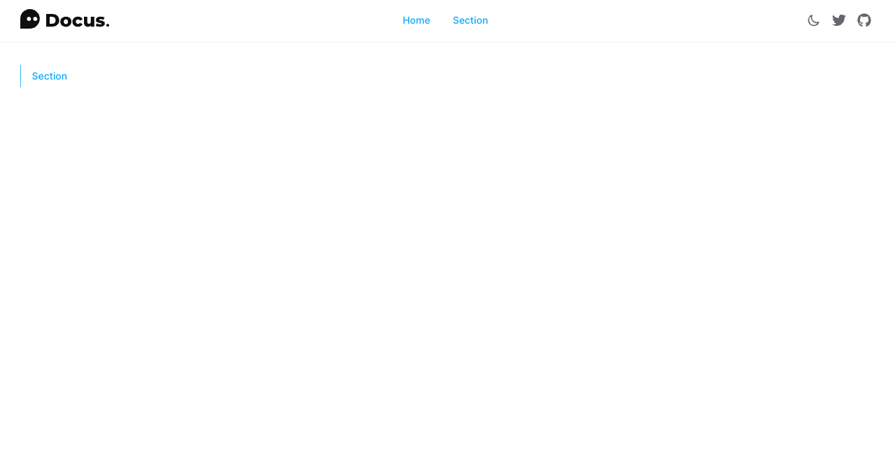
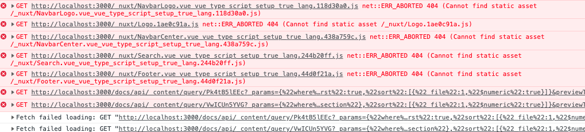

## Instructions

1. Go into `/docs` and run the following:
```
yarn install
yarn export-to-app
```

This will "generate" the Docs (Nuxt 3 + Docus) and copy the folder over to `/app/static/docs`

2. You can then start the app up by going to `/app` and running the following:
```
yarn
yarn dev
```

In `dev` mode, things seem to work fine if you go to `localhost:3000/docs` as seen here:



But if you run the following:
```
yarn build
yarn start
```

The Docus application doesn't function correctly as seen here:



There's a bunch of errors in the console:



---

## Some Feedback

- App is on Nuxt 2 + Bridge
- Docs is on Nuxt 3 + Docus
- For now, I'm keeping these applications separate as I can't currently upgrade my App to Nuxt 3
- As seen in screenshot above, Docus UI buttons seem to have extra top padding
- In recent Docus update, my `theme.config.ts` doesn't seem to be taken into account any longer.